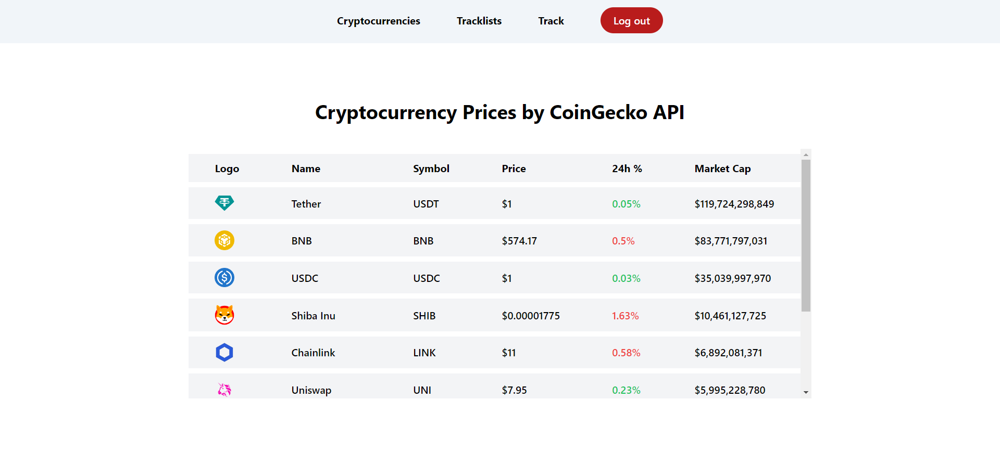
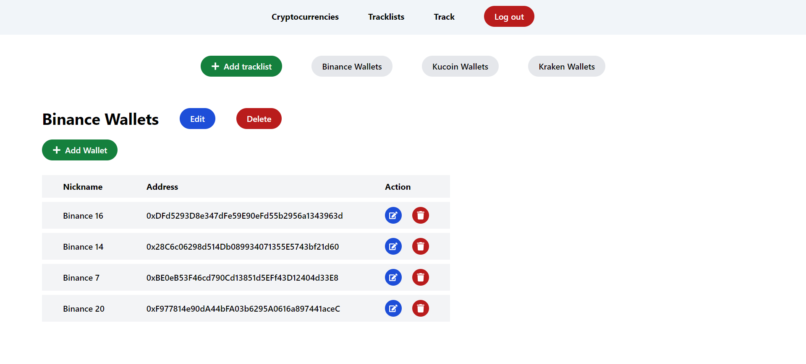

# Chain Sight

Chain Sight is a web application for tracking on-chain transactions and managing cryptocurrency investments. It provides users with a set of tools to analyze their cryptocurrency portfolios efficiently.

## Features

-   **real-time cryptocurrency prices**: access up-to-date cryptocurrency price information using CoinGecko API
-   **tracklists and wallets management**: organize on-chain analysis with customizable tracklists and wallets mechanism, providing a clear and structured view
-   **transaction monitoring**: keep track of recent wallet transactions using Etherscan API
-   in progress

## Tracklists Page

## Cryptocurrencies Page

## Track Page

